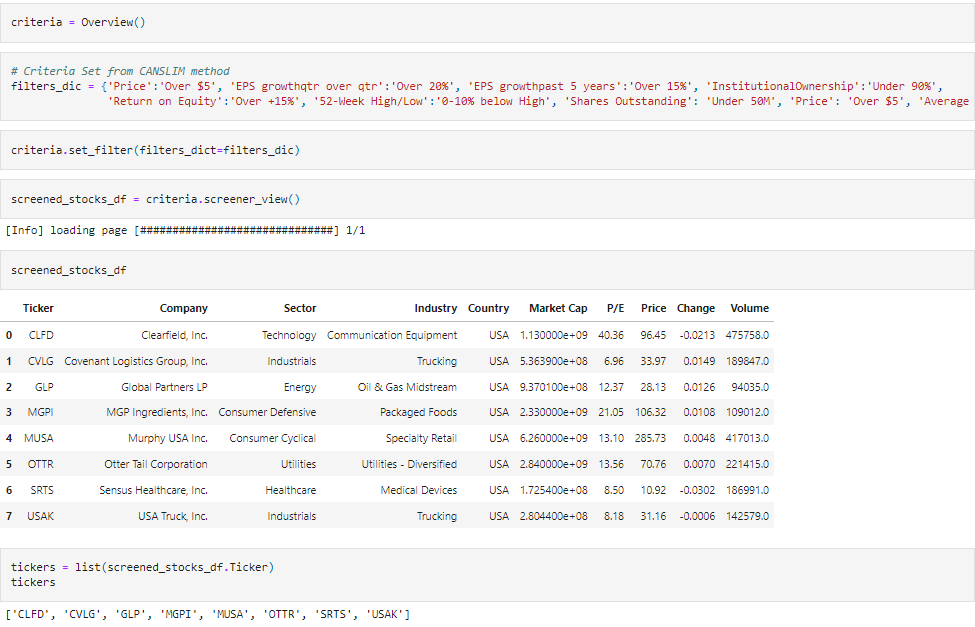
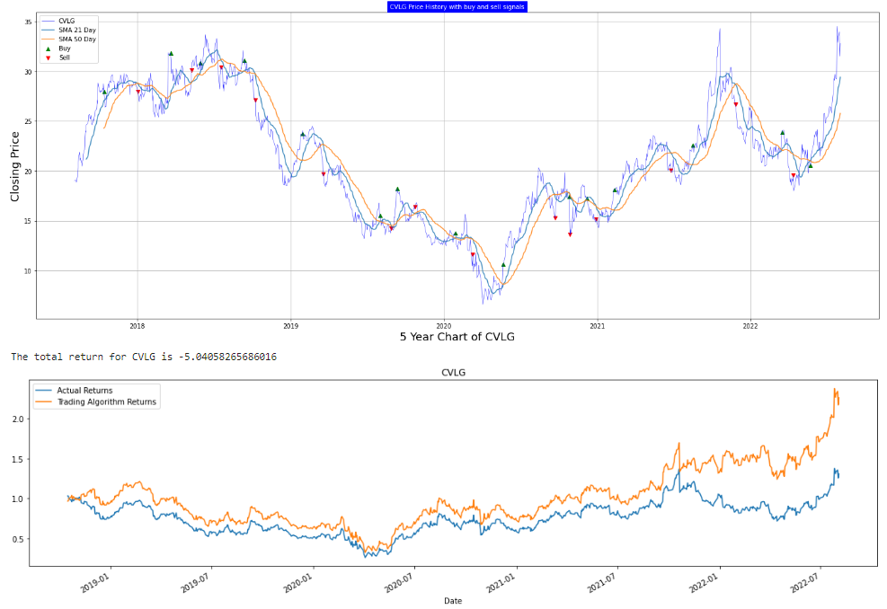
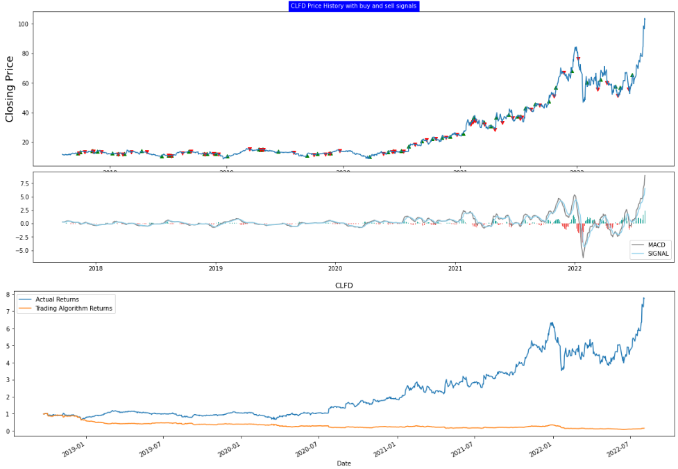
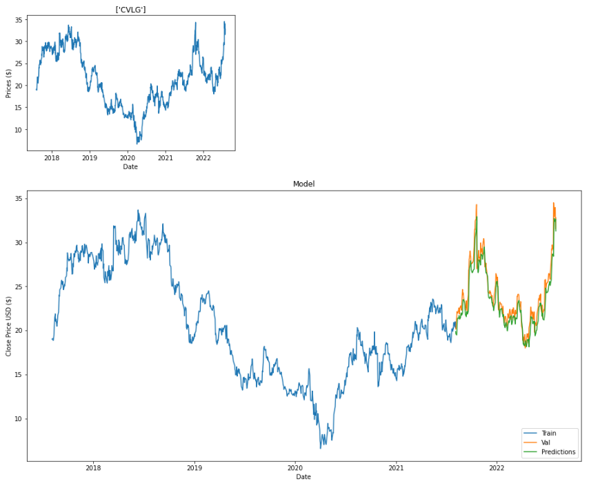

# JJ&N INVESTMENTS - PUT THE POWER OF MACHINE LEARNIING IN YOUR PORTFOLIO

## Introduction
This program uses the CANSLIM stock screener method, a system for selecting good-performing stocks by using a combination of fundamental and technical analysis techniques, to narrow down a list of stocks which can be analysed through the application of Machine Learning models. The analyses consists of buy/sell signals, visualizations, price direction forecast, etc.

## Technologies
**Libraries:
* Pandas
* Numpy
* Matplotlib
* Hvplot
* Sklearn
* TA lib
* Yahoo! Finance
* Finviz Finance

**Machine Learning Models:
* Algorithmic Trading with Machine Learning using SMA (Simple Moving Average) as a technical indicator
* Algorithmic Trading with Machine Learning using using MACD (Moving Average Convergence/Divergence)
* LSTM (Long Short Term Memory) for price forecast

## Usage and Benefits
* Emotions are a big factor lead to bad trading decisions, such as fear, greed, anger and disappointment. This program removes the interference of human emotion therefore, leading to effective trading decisions.
* Results in accuracy that is measurable.
* More confidence due to a fully scalable investment strategy.
* When the CANSLIM method is applied the results are filtered with the current (up-to-date) list of stocks that are outperforming in the market. The program's iteration functionality allows each stock that has been selected through the CANSLIM method to be analyzed, even if a different amount of stocks has been generated each time. Additionally, if a user would like to utilize a different strategy to select growth stocks, the program has the capability to utilize a different stock election strategy.

## Code Snippets and Results

**Stock screener code snippet**

**Algorithmic Trading with Machine Learning using SMA visualization**

**Algorithmic Trading with Machine Learning using MACD visualization**

**LSTM visualization**

## Contributors
* Jarrett Lidell
* Julian Louden
* Noman Zubairi